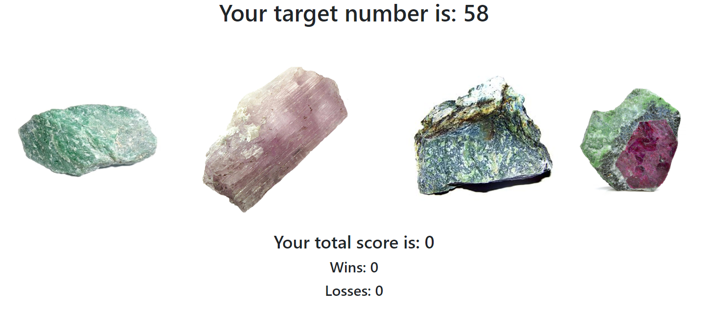

# unit-4-game

Crystal Collector Game

This game was created as an assignment for Georgia Tech's Coding Boot Camp.
Created using HTML, CSS, Boostrap, JavaScript, and jQuery.

How to play:
* You will be given a random target number at the start of the game between 19-120.
* Below the target number are four crystals which are given random hidden values between 1-12.
* Your goal is to reach the target number by clicking on the four crystals.
* If you're able to reach the target number without surpassing it, you win!
* If you surpass the target number, you lose.
* The game will reset after every win/loss, and the crystal values will be randomized again.

I intentionally decided to not style this much, because I used real pictures of raw gems.
The gems displayed are jadeite, kuznite, nephrite, and zoisite.
I chose these gems, because they are Endymion's four knights from Sailor Moon :)